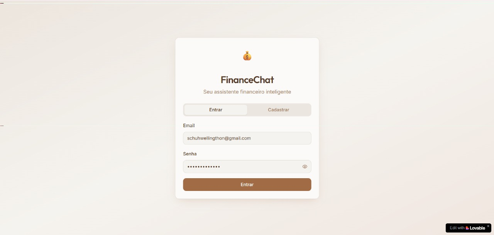
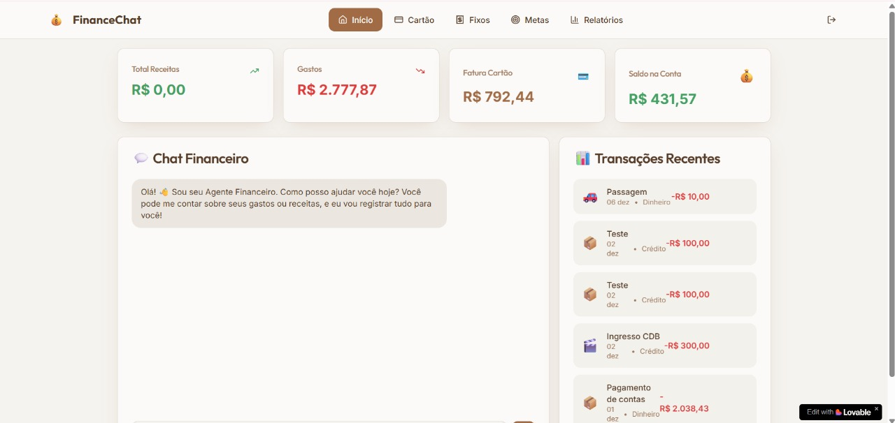
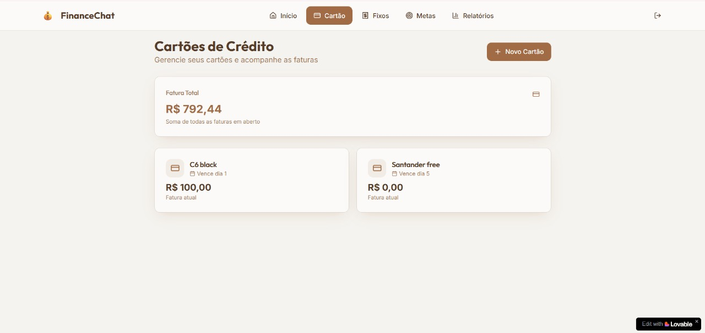
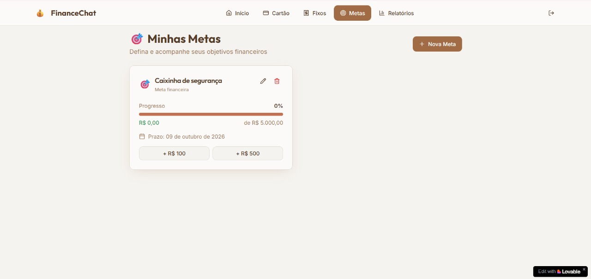
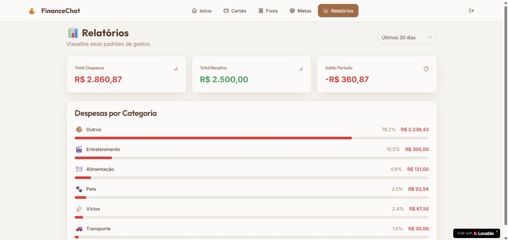

# 💬 FinanceChat

## 📌 Descrição
**FinanceChat** é uma aplicação de gerenciamento financeiro pessoal desenvolvida com auxílio do Copilot e publicada na plataforma **Lovable**.  
A proposta é oferecer uma experiência interativa e intuitiva para organizar suas finanças, registrar transações, acompanhar metas e visualizar relatórios — tudo por meio de um agente financeiro que conversa com você.

---

## 🌐 Acesso ao aplicativo
O FinanceChat está disponível online via Lovable:

👉 [Acessar FinanceChat](https://fin-talk-easy.lovable.app/reports)

⚠️ É necessário realizar login para acessar o sistema.

---

## 🧠 Funcionalidades
### 🏠 Início
- Chat interativo para registrar **gastos**, **receitas** e **pedir conselhos financeiros**
- Exibe **últimas transações**, **saldo atual** e **fatura do cartão**

### 💳 Cartões
- Adição de cartões sem dados sensíveis
- Acompanhamento de **faturas individuais** e **valor total gasto**
- Integração com os dados informados no chat

### 📅 Gastos Fixos
- Cadastro de **despesas mensais recorrentes**
- Previsão de gastos futuros
- Organização financeira antecipada

### 🎯 Metas
- Criação de **objetivos financeiros**
- Registro de depósitos e retiradas
- Acompanhamento de progresso com prazos e valores

### 📊 Relatórios
- Visualização de **gastos por categoria**
- Análise de **balanço mensal**
- Identificação de padrões de consumo

---

## 📸 Imagens de exemplo
### Login

### Tela inicial

### Cartões

### Gastos Fixos

### Metas

### Relatórios

---

## 📚 Aprendizados
- Criação de uma interface interativa com múltiplas seções financeiras  
- Uso de **chat inteligente** para entrada de dados  
- Organização de dados e visualização de relatórios  
- Publicação do projeto na plataforma **Lovable** com acesso via login  

---

## 👨‍💻 Autor
Feito por **Wellingthon Schuh**  
🔗 [LinkedIn](https://www.linkedin.com/in/wellingthonschuh)
